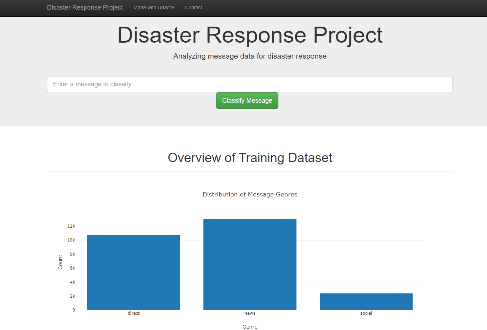

# Disaster-Response-Pipeline

## Table of Contents
* [Introduction](#Introduction)
* [Installation](#Installation)
* [Project Results](#Results)
* [Licensing, Authors, Acknowledgements](#License)

## Introduction<a name="Introduction"></a>
### Project Motivation 
There are many disaster related messages throughout various platforms such as social media. These messages would be very useful if they are well-categorized and sent to a proper disaster relief agency. In this project, I built a web application where an emergency worker can input a new message and get classification results in several categories. 

### Project Description 
The project aims to classify the type of the disaster messages collected from [Figure Eight](https://appen.com/) and service the inference based on a new input through a web application. To eleborate, I analyze the disaster response data (ETL data pipeline), and then build a classification model (ML pipeline) for an API that categories disaster events. Finally, I deploy a web app to provide the interface to classify the type of new disaster reponse from an user, as well as display visualizations of the data. Check below to see more details of each step. 

`ETL Pipeline` in [data/process_data.py](https://github.com/suhongkim/Disaster-Response-Pipeline/blob/main/data/process_data.py) 

- [x] Load and merge the two dataset: [disaster_messages.csv](https://github.com/suhongkim/Disaster-Response-Pipeline/blob/main/data/disaster_messages.csv) and [disaster_categories.csv](https://github.com/suhongkim/Disaster-Response-Pipeline/blob/main/data/disaster_categories.csv)
- [x] Clean the data
- [x] Save the data into an [SQLite database](https://github.com/suhongkim/Disaster-Response-Pipeline/blob/main/data/DisasterResponse.db)

`ML Pipeline` in [models/train_classifier.py](https://github.com/suhongkim/Disaster-Response-Pipeline/blob/main/model/train_classifier.py)

- [x] Load data from the SQLite database
- [x] Build a machine learning pipeline
- [x] Train and evaluate a model to find the best model using Grid-Search  
- [x] Export the final model as a pickle file

`Flask Web App` in [app/run.py](https://github.com/suhongkim/Disaster-Response-Pipeline/blob/main/app/run.py)

- [x] Visualize the data using Plotly
- [x] Deploy the web app 

## Installation<a name="Installation"></a>
### Environment Setup
All libraries are available in Anaconda distribution of Python 3.*. The used libraries are:
```
pandas
re
sys
json
sklearn
nltk
sqlalchemy
pickle
Flask
plotly
sqlite3
```

### How to Run 
- Run the following commands in the project's root directory to set up your database and model.
	- To run ETL pipeline that cleans data and stores in database  
	```
    python data/process_data.py data/disaster_messages.csv data/disaster_categories.csv data/DisasterResponse.db
    ```
	- To run ML pipeline that trains classifier and saves 
	```
    python models/train_classifier.py data/DisasterResponse.db models/classifier.pkl
    ```

- Run the following command in the app's directory to run your web app. 
	```
    cd app
    python run.py ../data/DisasterResponse.db ../models/classifier.pkl
    ```

- Go to http://0.0.0.0:3001/
   
## Project Results<a name="Results"></a>
### Model Evaluation Report 
---|accuracy|precision|recall|f1-score|distribution-0|distribution-1
---|---|---|---|---|---|---
---|accuracy|precision|recall|f1-score|distribution-0|distribution-1
---|---|---|---|---|---|---
related|0.725744843392|0.87|0.82|0.82|0.228800611154|0.771199388846
request|0.921313980138|0.85|0.78|0.77|0.822956455309|0.177043544691
offer|0.998090145149|0.85|0.79|0.78|0.995416348358|0.00458365164248
aid_related|0.819136745607|0.85|0.79|0.78|0.572574484339|0.427425515661
medical_help|0.961611917494|0.85|0.78|0.76|0.914056531704|0.0859434682964
medical_products|0.977081741788|0.85|0.78|0.77|0.946906035141|0.0530939648587
search_and_rescue|0.989304812834|0.86|0.81|0.8|0.972116119175|0.0278838808251
security|0.991596638655|0.84|0.77|0.76|0.981474407945|0.018525592055
military|0.985103132162|0.85|0.78|0.76|0.966768525592|0.0332314744079
child_alone|1.0|1.0|1.0|1.0|1.0|0.0
water|0.97268907563|0.85|0.79|0.78|0.934300993125|0.0656990068755
food|0.955500381971|0.85|0.79|0.78|0.893048128342|0.106951871658
shelter|0.959893048128|0.85|0.78|0.77|0.90756302521|0.0924369747899
clothing|0.994270435447|0.87|0.82|0.81|0.984148204736|0.0158517952636
money|0.991978609626|0.87|0.83|0.82|0.976699770817|0.0233002291826
missing_people|0.996180290298|0.88|0.84|0.83|0.988349885409|0.0116501145913
refugees|0.984148204736|0.84|0.76|0.75|0.966386554622|0.0336134453782
death|0.979946524064|0.85|0.79|0.78|0.952253628724|0.0477463712758
other_aid|0.942704354469|0.85|0.79|0.78|0.864400305577|0.135599694423
infrastructure_related|0.972498090145|0.85|0.79|0.78|0.933728036669|0.0662719633308
transport|0.980710466005|0.86|0.8|0.79|0.952635599694|0.0473644003056
buildings|0.978609625668|0.86|0.8|0.79|0.946142093201|0.0538579067991
electricity|0.988731856379|0.84|0.77|0.75|0.975744843392|0.0242551566081
tools|0.996944232238|0.82|0.71|0.69|0.994652406417|0.00534759358289
hospitals|0.995416348358|0.85|0.79|0.78|0.988922841864|0.011077158136
shops|0.998854087089|0.88|0.84|0.84|0.996371275783|0.00362872421696
aid_centers|0.993888464477|0.82|0.71|0.68|0.989495798319|0.0105042016807
other_infrastructure|0.98166539343|0.86|0.81|0.8|0.95282658518|0.0471734148205
weather_related|0.883689839572|0.86|0.8|0.79|0.709129106188|0.290870893812
floods|0.964094728801|0.86|0.8|0.79|0.910045836516|0.0899541634836
storm|0.961038961039|0.86|0.81|0.8|0.899923605806|0.100076394194
fire|0.997326203209|0.88|0.85|0.84|0.991214667685|0.00878533231474
earthquake|0.961993888464|0.86|0.8|0.79|0.905653170359|0.0943468296409
cold|0.992742551566|0.87|0.82|0.81|0.980328495034|0.0196715049656
other_weather|0.978609625668|0.86|0.81|0.81|0.943086325439|0.0569136745607
direct_report|0.911000763942|0.85|0.78|0.77|0.799083269672|0.200916730328
avg|0.963447500212206|0.8588888888888887|0.7994444444444445|0.7888888888888888|0.909366777013836|0.09063322298616415

### Web App 



## Licensing, Authors, Acknowledgements<a name="License"></a>
You can find the Licensing for the data and other descriptive information at the Figure Eight available [here](https://appen.com/). Also, some parts of the codes in this project are provided by Udacity Data Scientist Program. If you think that it is useful, please connect with me via [linkedIn-Suhong](https://www.linkedin.com/in/suhongkim/)
